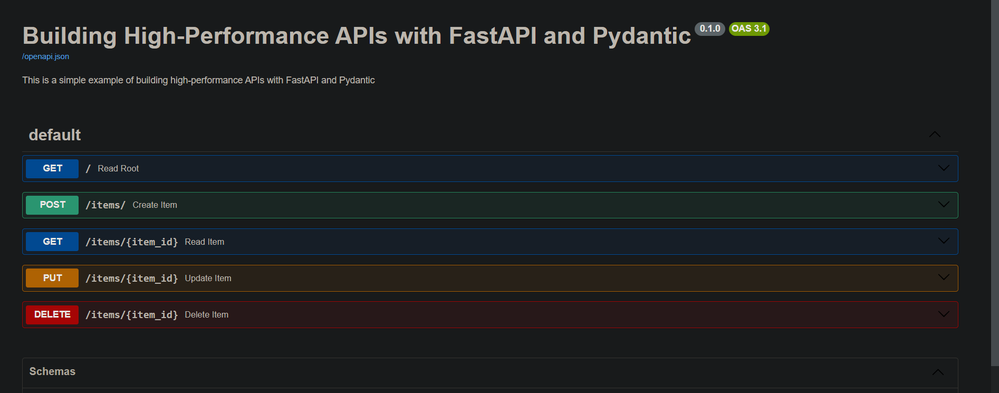
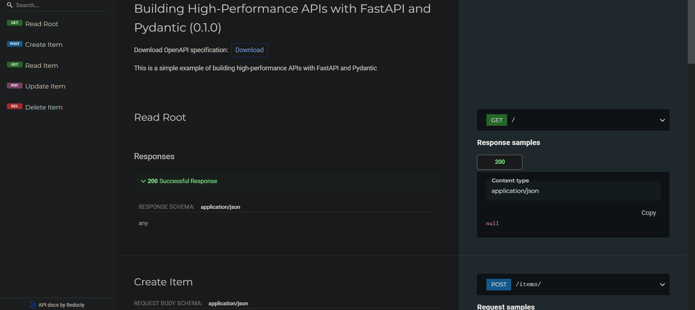

# Building High-Performance APIs with FastAPI and Pydantic

This project demonstrates how to build a simple, high-performance API using FastAPI and Pydantic. The application supports CRUD operations for managing items.

## Table of Contents

- [Introduction](#introduction)
- [Features](#features)
- [Installation](#installation)
- [API Endpoints](#api-endpoints)
- [Interactive API Documentation](#interactive-api-documentation)
- [Project Structure](#project-structure)


## Introduction

FastAPI is a modern, fast (high-performance) web framework for building APIs with Python 3.7+ based on standard Python type hints. It integrates seamlessly with Pydantic for data validation and settings management. This project showcases how to leverage these technologies to create efficient and robust APIs.

## Features

- **High Performance**: Comparable to NodeJS and Go.
- **Ease of Use**: Designed to be simple to use and learn.
- **Data Validation**: Using Pydantic models for robust data validation.
- **Type Hints**: Full support for Python type hints, enhancing code quality and reducing bugs.
- **Automatic Documentation**: Generates interactive API documentation with Swagger UI and ReDoc.

## Installation

Install the dependencies:

    ```sh
    pip install -r requirements.txt
    ```

## Running the Application

1. Start the main.py


2. Open your browser and navigate to `http://127.0.0.1:8000` to see the welcome message.

## API Endpoints

- **GET /**: Returns a welcome message.
- **POST /items/**: Creates a new item.
- **GET /items/{item_id}**: Retrieves an item by its ID.
- **PUT /items/{item_id}**: Updates an item by its ID.
- **DELETE /items/{item_id}**: Deletes an item by its ID.

## Interactive API Documentation

FastAPI provides interactive API documentation out of the box. You can access it at:

### Swagger UI


- URL: [http://127.0.0.1:8000/docs](http://127.0.0.1:8000/docs)

### ReDoc


- URL: [http://127.0.0.1:8000/redoc](http://127.0.0.1:8000/redoc)

These interfaces allow you to interact with your API endpoints, view request and response models, and test the API.

## Project Structure

```
fastapi_project/
├── main.py
├── models.py
├── requirements.txt
```

- **main.py**: Contains the main application logic and API endpoints.
- **models.py**: Defines the data models using Pydantic.
- **requirements.txt**: Lists the project dependencies.


----------------
